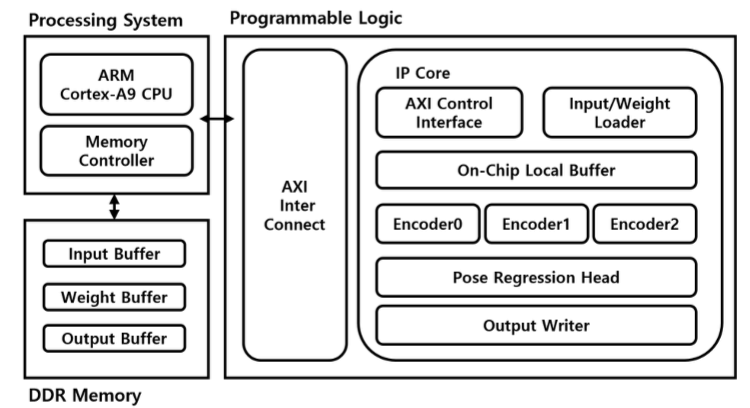
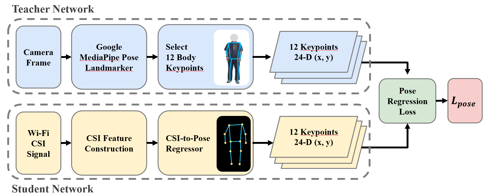
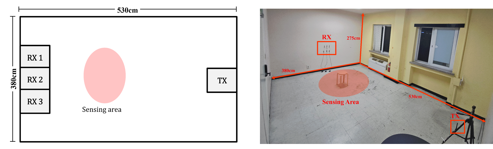
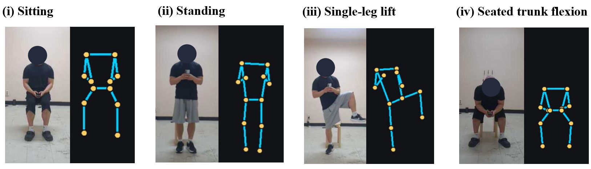
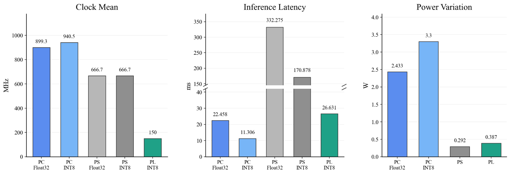
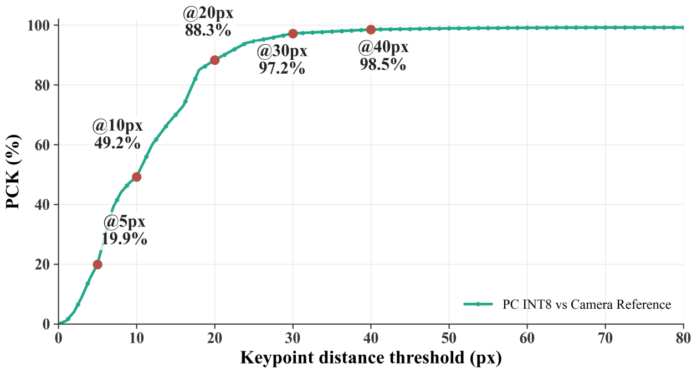

# Wi-Fi CSI 기반 실시간 인체 자세 추정 임베디드 시스템

Wi-Fi 신호(CSI)만을 입력으로 사용해 **카메라 없이** 사람의 2D 자세(12 keypoints)를 실시간 추정하는 임베디드 AI 시스템.
3개의 ESP32 수신 노드가 Wi-Fi 채널 변화를 수집하고, Zybo Z7-20(Zynq-7020)의 **PS(ARM Linux) + PL(FPGA) 협업 구조**에서 PC 서버 없이 온보드 추론을 수행한다.

<p align="center">
  <br>
  <sub><b>실시간 추론 데모</b> — 좌: 카메라 촬영 &nbsp;|&nbsp; 우: <b>Wi-Fi CSI만으로 추정한 실시간 skeleton</b>. </sub>
</p>


---

## 프로젝트 배경

카메라 기반 자세 추정은 세 가지 근본적 한계가 있다. **조명에 민감**해 어두운 환경에서 성능이 급락하고, 사람이나 가구에 가려지는 **가림 상황에 취약**하며, 무엇보다 **가정·병원·욕실처럼 사생활이 중요한 공간에는 카메라 자체를 설치하기 어렵다.**

이 프로젝트는 카메라를 완전히 제거하고, **Wi-Fi 신호가 인체에 의해 산란·반사되며 생기는 채널 상태 정보(CSI, Channel State Information)의 변화를 직접 입력으로 사용**한다. 사람이 움직이면 각 OFDM subcarrier의 진폭이 고유한 패턴으로 흔들리는데, 이 패턴에 자세 정보가 담겨 있다는 점을 이용한다.

핵심 설계 원칙은 두 가지다.

- **학습 때만 카메라, 배포 때는 Wi-Fi만** — 학습 단계에서만 MediaPipe를 teacher로 써서 keypoint 정답을 만들고, **실제 추론에는 어떤 카메라도 필요 없다.**
- **PC 서버 없는 온디바이스 추론** — 전체 추론을 Zynq SoC 위에서 완결한다. PS(ARM Cortex-A9 + PetaLinux)가 CSI 파싱·전처리·양자화를, PL(FPGA)이 HLS로 합성한 CNN 가속기 연산을 담당한다.

---

## Wi-Fi CSI란?

CSI(Channel State Information)는 Wi-Fi 신호가 송신기에서 수신기까지 오는 동안 겪은 채널의 상태를, **OFDM subcarrier(주파수 채널)별로 기록한 값**이다. 이 프로젝트에서는 각 subcarrier의 **진폭**을 사용한다.

방 안에 사람이 있으면 신호가 몸에 반사·산란되므로, **사람이 움직일 때마다 subcarrier별 진폭이 함께 출렁인다.** 아래 히트맵은 세로축이 subcarrier(0~127), 가로축이 시간이며, 색이 진폭이다. 왼쪽의 실제 동작과 오른쪽 CSI 히트맵을 나란히 보면, **같은 동작이 반복될 때 히트맵에도 주기적인 무늬가 나타나는 것**을 확인할 수 있다 — 즉, CSI 안에 자세·동작 정보가 담겨 있다.

<p align="center">
  <br>
  <sub>앉았다 일어서기(squat) — 좌: 실제 사람 움직임 &nbsp;|&nbsp; 우: 같은 시점의 Wi-Fi CSI 히트맵. 앉고 서는 반복이 히트맵의 주기적 줄무늬로 나타난다.</sub>
</p>

<p align="center">
  <br>
  <sub>다리 들었다 내리기 — 다리 움직임의 주기가 CSI 진폭 변동 주기와 그대로 대응된다.</sub>
</p>

---

## 시스템 구조

### 전체 시스템 구조

TX ESP32가 Wi-Fi 패킷을 브로드캐스트하면, 벽에 배치된 3개의 RX ESP32가 각자 받은 신호의 CSI를 수집한다. Coordinator ESP32가 3개 RX의 CSI를 시간 정렬해 하나의 프레임으로 묶은 뒤 Zybo로 전달하고, Zybo가 추론한 24차원 pose 벡터를 PC GUI로 보내 skeleton으로 시각화한다.

```
      [TX ESP32]
          │ Wi-Fi broadcast
   +------+------+
   │      │      │
[RX1]  [RX2]  [RX3]   ← CSI 수집 (OFDM subcarrier별 채널 응답)
   │      │      │
   +--UDP-+--UDP-+
          │
   [Coordinator ESP32]  ← 멀티 RX CSI 시간 정렬 · 집계
          │ USB-Serial
          ▼
   [Zybo Z7-20]  ← 온보드 추론 
    │                  │
[ PS (PetaLinux) ] AXI [ PL (HLS 가속기) ]
  CSI 파싱                 CNN Encoder × 3
  슬라이딩 윈도우             Feature 융합
  INT8 양자화               MLP Head
    │                         │
    └─────── 24D pose vector ──┘
                │
          UDP / UART
                │
          [PC GUI: skeleton]
```

### Zynq 온보드 추론 구조 (PS + PL)

추론 연산은 Zynq-7020 한 칩 안에서 PS와 PL이 역할을 나눠 처리한다. PS(ARM Cortex-A9)는 순차적이고 분기가 많은 작업(CSI 파싱, 슬라이딩 윈도우 구성, INT8 양자화)을 맡고, 대량의 곱셈-누산이 필요한 CNN 연산은 PL(FPGA)의 HLS IP Core로 오프로드한다. 둘은 AXI Interconnect로 연결되며, 가중치·입력·출력 버퍼를 DDR과 온칩 버퍼에 배치해 데이터 이동을 최소화했다.

<p align="center">
  <br>
  <sub>ARM Cortex-A9(PS) — AXI Interconnect — HLS IP Core(PL)</sub>
</p>

---

## 핵심 구현


### CSI 데이터 전처리 파이프라인 (`CachedWindowDataset`)

수집된 CSI 원시 데이터를 모델 입력 텐서로 변환하는 데이터셋을 설계했다. 핵심은 각 RX 신호를 **3개의 feature channel**로 구성해, 단순 진폭뿐 아니라 "움직임"과 "신뢰도"를 모델에 함께 넘기는 것이다.

```
입력 텐서 형상: [batch, node_count × 3, subcarriers, window_size]

각 RX 노드에 대해:
  - base  channel: 해당 시점의 CSI 진폭        (자세의 기준값)
  - delta channel: 이전 프레임 대비 변화량       (모션을 명시적으로 강조)
  - mask  channel: 유효 측정값 여부 (0/1)        (패킷 손실 구간 표시)
```

- **결측 처리**: 패킷 손실 구간은 `forward_fill`로 마지막 유효값을 전파하되, 허용 최대 갭(`max_gap`)을 넘으면 `mask=0`으로 표시해 학습 시 해당 샘플의 영향을 자동으로 줄인다.
- **윈도우 경계 오염 방지**: 슬라이딩 윈도우를 모든 시점에서 생성하면 서로 다른 녹화 파일에 걸친 윈도우가 만들어진다. `file_ids` 배열로 각 프레임의 원본 파일을 추적하고, 파일이 바뀌는 경계에서 윈도우를 끊어 데이터셋 오염을 막았다.

### CNN 모델 — MultiESPFastPoseCNN

3개의 RX를 각각 독립적으로 처리하되 **동일한 encoder 가중치를 공유**하는 구조로 설계했다. RX마다 별도 가중치를 두면 파라미터가 3배로 늘고 RX 배치가 조금만 바뀌어도 일반화가 깨지는데, 가중치를 공유하면 파라미터를 아끼면서 **"수신기 관점에 무관한" 특징**을 학습할 수 있다.

```python
class FastReceiverEncoder(nn.Module):
    def __init__(self, out_channels):
        self.layers = nn.Sequential(
            nn.Conv2d(3, mid_channels, kernel_size=(5, 3), padding=(2, 1), bias=False),
            nn.BatchNorm2d(mid_channels),
            nn.GELU(),
            nn.Conv2d(mid_channels, out_channels, kernel_size=(3, 3), padding=1, bias=False),
            nn.BatchNorm2d(out_channels),
            nn.GELU(),
            nn.AdaptiveAvgPool2d((8, 4)),  # 입력 subcarrier 수에 무관하게 고정 출력
        )
```

`AdaptiveAvgPool2d((8,4))`를 둔 이유는, subcarrier 수나 윈도우 길이가 달라져도 항상 `32×8×4`의 고정 크기 feature를 내보내 후단 MLP를 그대로 재사용하기 위해서다. 3개 RX의 출력을 channel 방향으로 concat해 융합한다.

```
RX1 → encoder → [32×8×4]
RX2 → encoder → [32×8×4]  →  Concat → [96×8×4] → Flatten → FC → 24D pose
RX3 → encoder → [32×8×4]
```

출력 24차원은 **12개 관절 × (x, y)** 좌표에 해당한다.

### Teacher–Student 학습 전략

카메라로 정답을 만들되(Teacher), 추론은 Wi-Fi로만(Student) 하도록 두 네트워크를 정렬했다. 학습 시 카메라 프레임을 MediaPipe에 통과시켜 얻은 12 keypoint를 정답으로 삼고, 같은 시점의 CSI를 입력받은 Student가 이를 회귀(regression)하도록 supervised 학습한다.

<p align="center">
  <br>
  <sub>Teacher(Camera + MediaPipe Pose Landmarker)가 만든 12 keypoint(24-D)를 정답으로, Student(Wi-Fi CSI → CSI-to-Pose Regressor)를 <code>L_pose</code>로 학습. 배포 시 Teacher 경로 전체가 제거된다.</sub>
</p>

### 학습 파이프라인

```python
criterion = nn.SmoothL1Loss()             # 이상치에 강건한 keypoint 회귀 손실
optimizer = AdamW(model.parameters(), lr=config.learning_rate, weight_decay=config.weight_decay)
scaler    = torch.amp.GradScaler("cuda")  # AMP (mixed precision)
```

- **SmoothL1Loss**: keypoint 예측이 가끔 크게 튀는 경우(예: 결측 구간)에 L2보다 손실이 덜 폭주해 학습이 안정적이다.
- **Early stopping**: `early_stopping_patience` 에폭 동안 val_loss 개선이 없으면 중단해 과적합을 막는다.
- **Checkpoint 재개**: `last_checkpoint.pt` / `best_model.pt`를 저장해 중단된 학습을 이어서 재개할 수 있다.
- **AMP**: CUDA 환경에서 FP16 mixed precision으로 학습 속도를 높이고 메모리를 절약한다.

### INT8 양자화 및 FPGA용 가중치 export

PL HLS 가속기가 **정수 연산만** 사용하도록, Conv+BN folding과 per-output-channel INT8 양자화를 구현했다.

```python
def fold_conv_bn(conv, bn):
    # BN을 Conv weight에 수학적으로 흡수 → 추론 시 BN 레이어 자체를 제거
    inv_std      = torch.rsqrt(bn.running_var + bn.eps)
    bn_scale     = bn.weight * inv_std
    fused_weight = conv.weight * bn_scale.reshape(-1, 1, 1, 1)
    fused_bias   = bn.bias + (conv.bias - bn.running_mean) * bn_scale
    return fused_weight, fused_bias

def quantize_multiplier(real_scale):
    # 실수 스케일을 (int32 multiplier, shift) 쌍으로 변환
    # → FPGA는 부동소수점 없이 정수 곱셈 + 비트 시프트만으로 역양자화 수행
    significand, exponent = math.frexp(real_scale)
    multiplier = int(round(significand * (1 << 31)))
    shift = 31 - exponent
    return multiplier, shift
```

- **Conv+BN folding**: 추론 시 BN을 별도 연산으로 두지 않고 Conv 가중치에 흡수시켜 레이어 수와 곱셈량을 줄인다.
- **per-channel 양자화**: 출력 채널마다 독립적인 스케일을 두어, 전체를 하나의 스케일로 뭉개는 것보다 정확도 손실을 최소화한다.
- **정수 역양자화**: 실수 스케일을 `(multiplier, shift)`로 변환해 FPGA에서 부동소수점 없이 재양자화(requantize)를 수행한다.

---

## 주요 기능

| 기능 | 설명 |
|:---|:---|
| 카메라 없는 자세 추정 | Wi-Fi CSI 진폭만으로 12-keypoint 2D pose를 추정 — 추론 단계에 카메라·라이다 등 광학 센서가 전혀 필요 없다 |
| Teacher–Student 학습 | 학습 때만 MediaPipe keypoint를 정답으로 사용하고, 배포 시 Teacher 경로를 완전히 제거 |
| 공유 가중치 인코더 | 3개 RX에 동일 CNN encoder를 재사용 → 파라미터 절감 + view-invariant feature |
| PS+PL 협업 추론 | Linux PS가 전처리·양자화, FPGA PL이 INT8 CNN을 가속 (PC 서버 불필요) |
| INT8 양자화 export | Conv+BN folding + per-channel quantization으로 HLS 정수 연산 파이프라인 생성 |
| 실시간 skeleton GUI | 24D pose 벡터를 UDP로 받아 12 keypoint를 실시간 시각화 |

---

## 하드웨어

| 부품 | 역할 |
|:---|:---|
| Zybo Z7-20 (Zynq-7020) | 메인 추론 보드 — PS(ARM Cortex-A9 + PetaLinux) + PL(FPGA HLS 가속기) |
| ESP32 × 3 (RX) | Wi-Fi CSI 수집, UDP로 Coordinator에 전달 |
| ESP32 × 1 (TX / Coordinator) | Wi-Fi 패킷 송신 + 멀티 RX CSI 시간 정렬·집계 + Zybo serial 전송 |

3개의 RX를 한쪽 벽에 나란히 배치하고 TX를 반대편에 고정해, 사람이 두 벽 사이를 지날 때 생기는 채널 변화를 최대한 크게 잡도록 배치했다. 실험 환경은 **5.3 m × 3.8 m 실내**다.

<p align="center">
  <br>
  <sub>벽에 설치된 ESP32 RX 노드 3개. 앞의 의자 위치가 sensing zone으로, 이 영역의 동작이 CSI 변화로 나타난다.</sub>
</p>

---

## 모델 구조

전체 모델은 **공유 encoder 3개 → 융합 → MLP head**의 단순한 흐름으로, FPGA에 올리기 쉽도록 의도적으로 가볍게 설계했다.

| 단계 | 레이어 | 출력 형상 |
|:---|:---|:---|
| Per-RX Encoder × 3 (공유 가중치) | Conv(5×3) → BN → GELU → Conv(3×3) → BN → GELU → AdaptiveAvgPool(8×4) | 32 × 8 × 4 |
| Feature Fusion | Concat (3 RX) | 96 × 8 × 4 |
| Flatten | — | 3072 |
| MLP | FC 3072→128 + GELU + Dropout | 128 |
| Output Head | FC 128→24 | 24 |

첫 Conv의 커널을 `5×3`으로 둔 것은 **subcarrier 축(주파수)보다 시간 축을 넓게 보기 위함**으로, 짧은 시간 구간의 움직임 패턴을 초기 레이어에서 포착하도록 했다.

---

## 성능

### 정성 결과 — 동작별 추정

<p align="center">
  <br>
  <sub>동작별 CSI-only 자세 추정 결과 (좌: 카메라 참조, 우: Wi-Fi CSI 예측). 앉기·서기·한 다리 들기·앉아 상체 숙이기 등 정적/동적 자세를 모두 구분한다.</sub>
</p>

### 추론 백엔드 비교

동일 모델을 5가지 백엔드로 실행해 지연시간과 소비전력을 비교했다. **핵심은 맨 아래 PL INT8**로, PC 대비 지연시간을 실시간 수준으로 유지하면서 전력은 한 자릿수 W로 낮췄다.

<p align="center">
  <br>
  <sub>PC Float32 / PC INT8 / PS Float32 / PS INT8 / PL INT8 — 클록, 지연시간, 소비전력 비교</sub>
</p>

| 백엔드 | 지연시간 (ms) | 소비전력 (W) | 해석 |
|:---|:---:|:---:|:---|
| PC Float32 | 22.458 | 2.433 | GPU/CPU 기준선 |
| PC INT8 | 11.306 | — | 양자화로 PC에서도 약 2배 가속 |
| PS Float32 | 332.275 | 0.292 | ARM 단독 추론은 너무 느려 실시간 불가 |
| PS INT8 | 170.878 | — | 정수화로 PS 단독도 2배 빨라지나 여전히 느림 |
| **PL INT8** | **26.631** | **0.387** | **FPGA 가속으로 PS 대비 약 6배 빠르고, PC Float32 수준 지연을 1/6 전력으로 달성** |

→ PS 단독(332 ms)으로는 실시간이 불가능하지만, CNN을 PL로 오프로드하자 26.6 ms(≈37 fps)로 떨어져 실시간 추론이 성립했다. 소비전력 0.387 W는 배터리·상시 구동 환경에도 적합한 수준이다.

### 추정 정확도 (PCK)

PCK(Percentage of Correct Keypoints)는 예측 keypoint가 정답에서 일정 픽셀 이내에 들어온 비율이다. 

<p align="center">
  <br>
  <sub>PC INT8 모델 기준, keypoint 거리 threshold별 PCK(%) 곡선</sub>
</p>

| 임계값 | PCK | 의미 |
|:---:|:---:|:---|
| @5px | 19.9% | 픽셀 단위 정밀 위치는 아직 어려움 |
| @10px | 49.2% | 절반가량이 10px 이내 |
| @20px | 88.3% | 대부분의 관절을 20px 이내로 맞힘 |
| @30px | 97.2% | 자세의 전체 형태는 사실상 정확 |
| @40px | 98.5% | — |

→ 픽셀 단위 초정밀도(@5px)는 낮지만, **@20px에서 88%, @30px에서 97%로 자세의 형태(앉음/섬/다리 들기 등)는 안정적으로 구분**한다. Wi-Fi라는 저해상도 센서의 특성상 "정확한 좌표"보다 "동작·자세 인식"에 강점이 있음을 보여준다.

### FPGA 구현 요약 (Zynq-7020)

| 지표 | 값 | 해석 |
|:---|:---|:---|
| 클록 주파수 | 150.015 MHz | 목표 150 MHz 타이밍으로 합성 |
| WNS (타이밍 여유) | +0.003 ns | **양수 → 타이밍 클로징 성공**, 150 MHz에서 안정 동작 |
| BRAM 사용률 | 86.79% | 가중치·특징맵을 온칩에 상주 → 현재 주 병목 자원 |
| DSP 사용률 | 32.45% | 곱셈기 여유 있음 (추가 병렬화 여지) |
| LUT 사용률 | 43.26% | 로직 여유 확보 |
| 소비 전력 | 2.085 W | 보드 전체(PS+PL) 기준 |


---

## 기술 스택

| 분류 | 사용 기술 |
|:---|:---|
| AI 모델 | PyTorch (CNN 설계, 학습, INT8 양자화) |
| 임베디드 앱 | C, PetaLinux (Zynq PS) |
| FPGA 가속기 | Vivado HLS (C++ → RTL 합성) |
| ESP32 펌웨어 | ESP-IDF (CSI 수집, UDP 통신) |
| 블록 디자인 | Vivado (AXI4 인터커넥트) |
| 데이터 수집 | MediaPipe Pose Landmarker (Teacher) |

---

## 소스 코드 구조

```
.
├── ESP-RX/                   ESP32 CSI 수신 펌웨어 (ESP-IDF)
├── ESP-TX/                   ESP32 TX / Coordinator 펌웨어
├── HLS/                      Vivado HLS CNN 가속기 (C++)
├── ML/
│   ├── src/
│   │   ├── data.py             CachedWindowDataset — sliding window, forward_fill
│   │   ├── original_models.py  MultiESPFastPoseCNN, FastReceiverEncoder
│   │   ├── training.py         학습 루프 (AMP, early stopping, checkpoint)
│   │   ├── int8_export.py      Conv+BN folding + per-channel INT8 양자화
│   │   ├── int8_reference.py   INT8 추론 Python 검증
│   │   ├── evaluation.py       평가 지표 (PCK 등)
│   │   └── prepare.py          데이터셋 전처리
│   ├── train_model.py          학습 진입점
│   ├── run_int8_fast_cnn.py    INT8 추론 실행
│   └── infer_gui.py            실시간 skeleton GUI
├── petalinux/                PetaLinux 프로젝트 설정
├── vivado/                   Block design TCL + XDC
└── tools/                    유틸리티 스크립트
```

---

## 빌드 및 실행

### 모델 학습
```bash
cd ML
pip install torch numpy mediapipe
python train_model.py --config configs/multi_esp_fast_pose_cnn.json
```

### INT8 양자화 및 Export
```bash
python run_int8_fast_cnn.py    # INT8 추론 검증
```

### HLS 가속기 합성
```bash
cd HLS
vitis_hls -f run_hls.tcl       # IP export
# Vivado에서 block design에 IP import → bitstream 생성
```

### PetaLinux 이미지 빌드
```bash
cd petalinux
petalinux-config --get-hw-description=../vivado/build.xsa
petalinux-build
petalinux-package --boot --fsbl --fpga --u-boot --force
# 생성된 BOOT.BIN + image.ub → SD카드 복사 후 Zybo 부팅
```

### 실시간 추론 및 시각화
```bash
# Zybo 시리얼 콘솔에서
./zybo_motion_accel --output udp --udp-target 192.168.1.100:5005

# PC에서
python ML/infer_gui.py --source udp --port 5005
```

---

## 기술적 문제 해결

### 1. 다중 RX 시간 정렬 문제
각 ESP32 RX가 UDP를 보내는 타이밍이 달라, coordinator에서 시간 정렬 없이 묶으면 **서로 다른 시점의 CSI가 하나의 입력 프레임으로 섞이는** 문제가 있었다.
→ Coordinator가 RX별 타임스탬프를 기록하고, 동일 시간 구간의 패킷만 묶어 하나의 CSI cycle frame으로 구성하도록 했다.

### 2. CSI 드롭아웃으로 인한 학습 불안정
Wi-Fi 패킷 손실 구간에서 CSI 값이 비었을 때 이를 0으로 채우면, 모델이 **"신호 없음"을 하나의 자세 패턴으로 잘못 학습**한다. 실제 데이터에서 특정 RX의 유효 프레임 비율이 0.4 수준까지 떨어지는 구간이 존재했다.
→ `forward_fill`로 마지막 유효값을 전파하고 `mask=0`으로 무효 구간을 명시해, 모델이 유효 신호와 결측을 구분하도록 설계했다.

### 3. 공유 encoder와 RX 위치 불변성
RX 3개의 배치 위치가 바뀌거나 일부 RX가 더 약한 신호를 받을 때, 위치별로 다른 가중치를 쓰면 일반화가 어렵다.
→ 동일한 `FastReceiverEncoder`를 3 RX에 공유해, 각 수신기 관점의 feature를 같은 방식으로 뽑고 이후 융합 단계에서 view-invariant representation을 학습하도록 했다.

### 4. 실시간성을 위한 연산 분할 (PS vs PL)
ARM(PS) 단독 추론은 332 ms로 실시간(수십 ms)에 한참 못 미쳤다.
→ 분기가 많은 전처리·양자화는 PS에 남기고, 곱셈-누산이 지배적인 CNN 본체만 PL(FPGA)로 오프로드해 **26.6 ms로 약 6배 단축**, 실시간 추론을 성립시켰다.

---

## 참고 문헌

1. F. Wang et al., "Person-in-WiFi: Fine-Grained Person Perception Using WiFi," ICCV 2019.
2. M. Zhao et al., "Through-Wall Human Pose Estimation Using Radio Signals," CVPR 2018.
3. R. Du, "An Overview on IEEE 802.11bf: WLAN Sensing," IEEE Communications Surveys & Tutorials, 2025.
